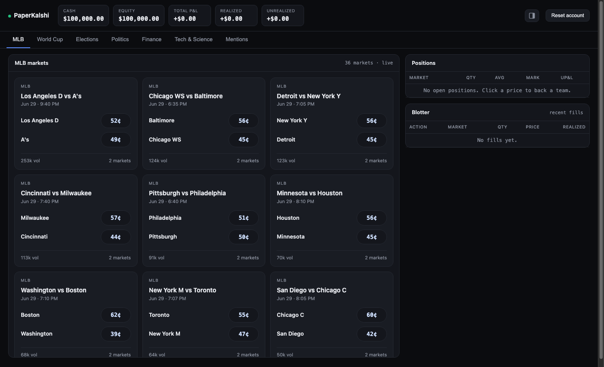

# PaperKalshi

**Paper-trade live [Kalshi](https://kalshi.com) prediction markets with a fake $100,000 account.**

PaperKalshi is a self-hosted trading terminal for practicing on **real Kalshi
markets** without risking real money. It streams live, public market data (no API key
needed), lets you buy and sell contracts against the real top-of-book, can charge the real
Kalshi taker fee, and tracks your positions, P&L, and settlements, all stored locally on
your machine.



> [!IMPORTANT]
> PaperKalshi is an independent project and is **not affiliated with, endorsed by, or
> connected to Kalshi**. It only reads Kalshi's public market data. **No real orders are
> ever placed and no real money is involved** — every trade is simulated on your own
> machine. This is for educational and entertainment purposes only and is not financial
> advice.

## Features

- **Live markets, real prices** — event cards across MLB, World Cup, Elections, Politics,
  Finance, Tech & Science, and Mentions, each showing Kalshi's live YES/NO top-of-book.
- **Binary and multi-outcome events** — single-market games render both Yes and No pills
  so you can fade either side; multi-outcome races (e.g. a nominee field) list their top
  outcomes with a "+N more" roll-up.
- **Two fill models** — by default the simulator assumes perfect liquidity: buys and sells
  fill at the mid with no bid/ask spread and no fees, so you can isolate your read on a
  market from execution costs. Flip on **Realistic fills** in the topbar to model real
  execution instead: buys are marketable and fill at the ask, closes hit the bid, and the
  real Kalshi taker fee (`ceil(0.07 · C · P · (1 − P))`) is applied to every order. The
  choice is persisted with your account.
- **Live account** — cash, equity, realized and unrealized P&L, a collapsible positions
  panel with mark-to-market and one-click close, and a fill blotter.
- **Automatic settlement** — open positions settle to $1/$0 when a market resolves.
- **Local and private** — your account lives in a local SQLite file; nothing is ever sent
  to Kalshi. A fresh install starts you at a clean $100,000.
- **Zero build step** — a single vanilla-JS page with inline SVG; just run the server.

## Requirements

- [Python 3.13+](https://www.python.org/)
- [uv](https://docs.astral.sh/uv/)
- A modern web browser

## Quick start

```bash
./run.sh
```

This serves the terminal at <http://127.0.0.1:8137> and opens your browser. The first run
creates a virtualenv and installs dependencies (one-time); later runs start instantly.

Prefer to drive it manually?

```bash
uv venv --python 3.13
uv pip install -e ".[dev]"
uv run paperkalshi
```

## Configuration

All configuration is via environment variables:

| Variable                 | Default            | Description                                             |
| ------------------------ | ------------------ | ------------------------------------------------------- |
| `PAPERKALSHI_PORT`       | `8137`             | Port the terminal listens on.                           |
| `PAPERKALSHI_NO_BROWSER` | _(unset)_          | Set to `1` to skip auto-opening a browser (headless).   |
| `PAPERKALSHI_DB`         | `data/paper.db`    | Path to the SQLite account file.                        |

The UI also accepts a couple of deep-link conveniences: `?cat=<key>` opens a specific
category tab (e.g. `?cat=elections`) and `#compact` starts with the positions panel hidden.

## How it works

- **Market data** is read from Kalshi's public REST API (production base
  `api.elections.kalshi.com/trade-api/v2`); no account or key is required. Trending events
  and per-category cards are cached briefly and fetches are concurrency-capped so the app
  stays well within Kalshi's read rate limits.
- **Trading is simulated locally.** When you place an order, the app pulls a fresh quote and
  fills it: at the mid with no fee by default, or against the live top-of-book with the
  taker fee when **Realistic fills** is on. Positions mark to the mid; resolved markets
  settle to $1/$0.
- **Persistence** is a single SQLite file (`data/paper.db`, gitignored). It is created on
  first run with a fresh $100,000 account and survives restarts. "Reset account" (or
  deleting the file) returns you to a clean $100k.

## Project layout

```
paperkalshi/
  server.py        # FastAPI app + the `paperkalshi` entrypoint
  kalshi.py        # Kalshi REST client (public market data; RSA signing for the write path)
  kalshi_live.py   # category tabs + the event-card board builders
  paper.py         # the $100k paper broker: positions, P&L, settlement (SQLite)
  fees.py          # Kalshi fee model (+ the FeeModel protocol)
  static/trade.html  # the single-page UI (vanilla JS, inline SVG)
tests/             # offline tests (broker, client signing, routes)
data/              # gitignored: your local paper.db
docs/              # screenshot used in this README
```

## Testing

```bash
uv run pytest -q
```

The suite is fully offline (no network) and covers the paper broker, the Kalshi client's
request signing, and the web routes.

## License

No open-source license is granted. The source is publicly viewable but **all rights are
reserved** — please ask before reusing it.
